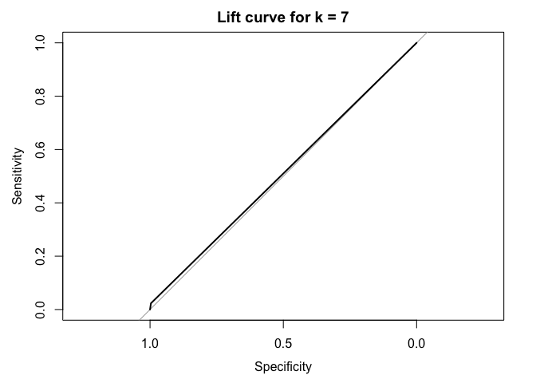

Assignment 1.1 - Charles Book Club
================
Gabe
2024-09-07

The company is looking to target its customers more accurately. The
company would like to use the information contained in their databases
to identify who is most likely to be interested in a specific offer.
This information enables them to design special programs carefully
tailored to meet their customer segments varying needs. In this use
case, you will be applying multiple data mining techniques, including
k-NN and logistic regression models.

The company two common membership programs: the continuity program, a
reader signs up by accepting an offer of several books for just a few
dollars (including shipping and handling) and an agreement to receive a
shipment of one or two books each month thereafter at more-standard
pricing. - common for childern’s books - CON depends on the qulality of
its selections

- the negative option plan, a reader receives a monthly announcement
  describing the book of the month. If the reader does not return the
  announcement by a specified date, the book is shipped and the reader
  is billed.
- common for adult books

NOTES:

- **Charles Book Club Overview:**
  - Established in 1986 with a focus on understanding customer
    preferences.
  - CBC offered specialty books through direct marketing channels (media
    advertising, mailing).
  - Built a database of 500,000 active members acquired through
    advertising in specialty magazines.
- **Problem Statement:**
  - Despite an increase in customer database and mailing volume, CBC’s
    profits were declining.
  - Previous mailing strategies were untargeted, leading to
    inefficiencies in customer engagement and profitability.
- **Proposed Solution:**
  - CBC management decided to adopt database marketing techniques to
    improve targeting.
  - The goal was to identify the most profitable customers and design
    targeted campaigns.
  - A two-step process was proposed:
    1.  Conduct a market test on 4000 customers to develop response
        models.
    2.  Use response models to create a targeted customer list for
        promotional mailings.
- **Data Mining Techniques Utilized:**
  - **k-Nearest Neighbors (k-NN):** Used to classify customers based on
    purchasing behavior.
  - **Logistic Regression:** Applied to model response probabilities and
    predict customer behavior.
  - **RFM Segmentation (Recency, Frequency, Monetary):** Used to
    categorize customers into homogeneous segments based on past
    purchase behavior.
- **Assignment Goals:**
  - Analyze CBC’s customer data using k-NN, logistic regression, and RFM
    segmentation.
  - Optimize promotional mailings by targeting the most responsive
    customer segments.
  - Provide data-driven recommendations to enhance CBC’s marketing
    effectiveness and profitability.

------------------------------------------------------------------------

``` r
# load the data
cbc_data <- read.csv("/Users/gabrielmancillas/Desktop/ADS 505-01/Mod 01/Assignment/CharlesBookClub.csv")

# display the structure of the dataset
str(cbc_data)
```

    ## 'data.frame':    4000 obs. of  24 variables:
    ##  $ Seq.            : int  1 2 3 4 5 6 7 8 9 10 ...
    ##  $ ID.             : int  25 29 46 47 51 60 61 79 81 90 ...
    ##  $ Gender          : int  1 0 1 1 1 1 1 1 1 1 ...
    ##  $ M               : int  297 128 138 228 257 145 190 187 252 240 ...
    ##  $ R               : int  14 8 22 2 10 6 16 14 10 6 ...
    ##  $ F               : int  2 2 7 1 1 2 1 1 1 3 ...
    ##  $ FirstPurch      : int  22 10 56 2 10 12 16 14 10 20 ...
    ##  $ ChildBks        : int  0 0 2 0 0 0 0 1 0 0 ...
    ##  $ YouthBks        : int  1 0 1 0 0 0 0 0 0 0 ...
    ##  $ CookBks         : int  1 0 2 0 0 0 0 0 0 1 ...
    ##  $ DoItYBks        : int  0 0 0 0 0 0 0 0 0 0 ...
    ##  $ RefBks          : int  0 0 1 0 0 0 0 0 0 0 ...
    ##  $ ArtBks          : int  0 0 0 0 0 0 0 0 0 0 ...
    ##  $ GeogBks         : int  0 0 1 0 0 0 1 0 0 0 ...
    ##  $ ItalCook        : int  0 0 1 0 0 0 0 0 0 0 ...
    ##  $ ItalAtlas       : int  0 0 0 0 0 0 0 0 0 0 ...
    ##  $ ItalArt         : int  0 0 0 0 0 0 0 0 0 0 ...
    ##  $ Florence        : int  0 0 0 0 0 0 0 0 0 0 ...
    ##  $ Related.Purchase: int  0 0 2 0 0 0 1 0 0 0 ...
    ##  $ Mcode           : int  5 4 4 5 5 4 4 4 5 5 ...
    ##  $ Rcode           : int  4 3 4 1 3 2 4 4 3 2 ...
    ##  $ Fcode           : int  2 2 3 1 1 2 1 1 1 3 ...
    ##  $ Yes_Florence    : int  0 0 0 0 0 0 0 0 0 0 ...
    ##  $ No_Florence     : int  1 1 1 1 1 1 1 1 1 1 ...

``` r
# display the summary statistics of the dataset
summary(cbc_data)
```

    ##       Seq.           ID.            Gender             M        
    ##  Min.   :   1   Min.   :   25   Min.   :0.0000   Min.   : 15.0  
    ##  1st Qu.:1001   1st Qu.: 8253   1st Qu.:0.0000   1st Qu.:129.0  
    ##  Median :2000   Median :16581   Median :1.0000   Median :208.0  
    ##  Mean   :2000   Mean   :16595   Mean   :0.7045   Mean   :208.1  
    ##  3rd Qu.:3000   3rd Qu.:24838   3rd Qu.:1.0000   3rd Qu.:283.0  
    ##  Max.   :4000   Max.   :32977   Max.   :1.0000   Max.   :479.0  
    ##        R               F            FirstPurch       ChildBks     
    ##  Min.   : 2.00   Min.   : 1.000   Min.   : 2.00   Min.   :0.0000  
    ##  1st Qu.: 8.00   1st Qu.: 1.000   1st Qu.:12.00   1st Qu.:0.0000  
    ##  Median :12.00   Median : 2.000   Median :20.00   Median :0.0000  
    ##  Mean   :13.39   Mean   : 3.833   Mean   :26.51   Mean   :0.6398  
    ##  3rd Qu.:16.00   3rd Qu.: 6.000   3rd Qu.:36.00   3rd Qu.:1.0000  
    ##  Max.   :36.00   Max.   :12.000   Max.   :99.00   Max.   :7.0000  
    ##     YouthBks         CookBks          DoItYBks          RefBks      
    ##  Min.   :0.0000   Min.   :0.0000   Min.   :0.0000   Min.   :0.0000  
    ##  1st Qu.:0.0000   1st Qu.:0.0000   1st Qu.:0.0000   1st Qu.:0.0000  
    ##  Median :0.0000   Median :0.0000   Median :0.0000   Median :0.0000  
    ##  Mean   :0.3048   Mean   :0.7312   Mean   :0.3508   Mean   :0.2562  
    ##  3rd Qu.:0.0000   3rd Qu.:1.0000   3rd Qu.:1.0000   3rd Qu.:0.0000  
    ##  Max.   :5.0000   Max.   :7.0000   Max.   :5.0000   Max.   :4.0000  
    ##      ArtBks         GeogBks          ItalCook        ItalAtlas     
    ##  Min.   :0.000   Min.   :0.0000   Min.   :0.0000   Min.   :0.0000  
    ##  1st Qu.:0.000   1st Qu.:0.0000   1st Qu.:0.0000   1st Qu.:0.0000  
    ##  Median :0.000   Median :0.0000   Median :0.0000   Median :0.0000  
    ##  Mean   :0.289   Mean   :0.3875   Mean   :0.1253   Mean   :0.0375  
    ##  3rd Qu.:0.000   3rd Qu.:1.0000   3rd Qu.:0.0000   3rd Qu.:0.0000  
    ##  Max.   :5.000   Max.   :6.0000   Max.   :3.0000   Max.   :2.0000  
    ##     ItalArt           Florence      Related.Purchase     Mcode      
    ##  Min.   :0.00000   Min.   :0.0000   Min.   :0.000    Min.   :1.000  
    ##  1st Qu.:0.00000   1st Qu.:0.0000   1st Qu.:0.000    1st Qu.:4.000  
    ##  Median :0.00000   Median :0.0000   Median :0.000    Median :5.000  
    ##  Mean   :0.04575   Mean   :0.0845   Mean   :0.885    Mean   :4.281  
    ##  3rd Qu.:0.00000   3rd Qu.:0.0000   3rd Qu.:1.000    3rd Qu.:5.000  
    ##  Max.   :2.00000   Max.   :1.0000   Max.   :8.000    Max.   :5.000  
    ##      Rcode          Fcode        Yes_Florence     No_Florence    
    ##  Min.   :1.00   Min.   :1.000   Min.   :0.0000   Min.   :0.0000  
    ##  1st Qu.:3.00   1st Qu.:1.000   1st Qu.:0.0000   1st Qu.:1.0000  
    ##  Median :3.00   Median :2.000   Median :0.0000   Median :1.0000  
    ##  Mean   :3.17   Mean   :2.086   Mean   :0.0845   Mean   :0.9155  
    ##  3rd Qu.:4.00   3rd Qu.:3.000   3rd Qu.:0.0000   3rd Qu.:1.0000  
    ##  Max.   :4.00   Max.   :3.000   Max.   :1.0000   Max.   :1.0000

``` r
# display the first few rows of the dataset
head(cbc_data)
```

    ##   Seq. ID. Gender   M  R F FirstPurch ChildBks YouthBks CookBks DoItYBks RefBks
    ## 1    1  25      1 297 14 2         22        0        1       1        0      0
    ## 2    2  29      0 128  8 2         10        0        0       0        0      0
    ## 3    3  46      1 138 22 7         56        2        1       2        0      1
    ## 4    4  47      1 228  2 1          2        0        0       0        0      0
    ## 5    5  51      1 257 10 1         10        0        0       0        0      0
    ## 6    6  60      1 145  6 2         12        0        0       0        0      0
    ##   ArtBks GeogBks ItalCook ItalAtlas ItalArt Florence Related.Purchase Mcode
    ## 1      0       0        0         0       0        0                0     5
    ## 2      0       0        0         0       0        0                0     4
    ## 3      0       1        1         0       0        0                2     4
    ## 4      0       0        0         0       0        0                0     5
    ## 5      0       0        0         0       0        0                0     5
    ## 6      0       0        0         0       0        0                0     4
    ##   Rcode Fcode Yes_Florence No_Florence
    ## 1     4     2            0           1
    ## 2     3     2            0           1
    ## 3     4     3            0           1
    ## 4     1     1            0           1
    ## 5     3     1            0           1
    ## 6     2     2            0           1

``` r
set.seed(1)  # Set seed for reproducibility
trainIndex <- createDataPartition(cbc_data$Florence, p = 0.6, list = FALSE)
train_data <- cbc_data[trainIndex, ]
validation_data <- cbc_data[-trainIndex, ]

# question 1.1 Calculate response reate for the training data and RFM combinations. 

# over response rate for training data
overall_response_rate <- mean(train_data$Florence)
print(paste("Overall Response Rate for Training Data:", overall_response_rate))
```

    ## [1] "Overall Response Rate for Training Data: 0.0870833333333333"

``` r
# This response rate indicates that around 8.7% of the customers in the training data have purchased "The Art History of Florence" book.

# This groups the data by the RFM categories and calculates the response rate for each group. Then, we filter for combinations where the response rate is above the overall response rate of 8.7%. These are the “above-average” RFM combinations.

# calculate response rates for each RFM category
rfm_response_rate <- train_data %>%
  group_by(R, F, M) %>%
  summarize(response_rate = mean(Florence))
```

    ## `summarise()` has grouped output by 'R', 'F'. You can override using the
    ## `.groups` argument.

``` r
# Find combinations with above-average response rates
above_average_combinations <- rfm_response_rate %>%
  filter(response_rate > overall_response_rate)

print(above_average_combinations)
```

    ## # A tibble: 206 × 4
    ## # Groups:   R, F [91]
    ##        R     F     M response_rate
    ##    <int> <int> <int>         <dbl>
    ##  1     2     1   131           1  
    ##  2     2     1   140           1  
    ##  3     2     1   148           1  
    ##  4     2     1   152           0.5
    ##  5     2     1   230           1  
    ##  6     2     1   297           1  
    ##  7     2     1   299           1  
    ##  8     2     2    43           1  
    ##  9     2     2   203           0.5
    ## 10     2     2   274           1  
    ## # ℹ 196 more rows

### Question 1.2: Compute the response rate for validation data using “above-average” RFM combinations

``` r
# Filter validation data based on above-average RFM combinations
validation_selected <- validation_data %>%
  semi_join(above_average_combinations, by = c("R", "F", "M"))

# Compute response rate for validation data
validation_response_rate <- mean(validation_selected$Florence)
print(paste("Validation response rate for above-average combinations:", validation_response_rate))
```

    ## [1] "Validation response rate for above-average combinations: 0.15"

### Results Question 1:

- **Overall Response Rate for Training Data**: ~8.7%
- **Response Rates for RFM Combinations**: Identified above-average
  combinations where the response rate is greater than 8.7%.
- **Validation Response Rate**: The response rate for the
  “above-average” combinations in the validation data is approximately
  **15%**.

By targeting only these above-average RFM combinations, the response
rate increases significantly, which supports the use of targeted
marketing to improve campaign effectiveness.

------------------------------------------------------------------------

### Question 2: k-Nearest Neighbors (k-NN) Classification

In this question, we are asked to classify customers using the k-nearest
neighbors (k-NN) algorithm based on the variables **Recency (R)**,
**Frequency (F)**, **Monetary (M)**, **First Purchase**, and **Related
Purchases**. The goal is to find the best value of $k$ by evaluating
performance on the validation set.

### Question 2: k-NN classification

``` r
### Question 2: k-NN classification

# Normalize relevant variables using mutate(across())
normalize <- function(x) {
  return((x - min(x)) / (max(x) - min(x)))
}

train_data_norm <- train_data %>%
  mutate(across(c(R, F, M, FirstPurch, Related.Purchase), normalize))

validation_data_norm <- validation_data %>%
  mutate(across(c(R, F, M, FirstPurch, Related.Purchase), normalize))
```

``` r
# Prepare input and output for k-NN
train_x <- train_data_norm %>% select(R, F, M, FirstPurch, Related.Purchase)
train_y <- train_data_norm$Florence

validation_x <- validation_data_norm %>% select(R, F, M, FirstPurch, Related.Purchase)
validation_y <- validation_data_norm$Florence

# Perform k-NN for k = 1 to 11
k_values <- 1:11
accuracy_results <- data.frame(k = k_values, accuracy = NA)

for (i in seq_along(k_values)) {
  knn_pred <- knn(train_x, validation_x, train_y, k = k_values[i])
  accuracy_results$accuracy[i] <- mean(knn_pred == validation_y)
}

# Display the accuracy for each k
accuracy_results
```

    ##     k accuracy
    ## 1   1 0.856250
    ## 2   2 0.866875
    ## 3   3 0.908750
    ## 4   4 0.905625
    ## 5   5 0.915000
    ## 6   6 0.913125
    ## 7   7 0.918125
    ## 8   8 0.917500
    ## 9   9 0.917500
    ## 10 10 0.917500
    ## 11 11 0.918125

``` r
# Find the best k
best_k <- accuracy_results[which.max(accuracy_results$accuracy), "k"]
print(paste("Best k:", best_k))
```

    ## [1] "Best k: 7"

### Explanation of the Script:

- The **normalize** function scales the numeric variables to a \[0,1\]
  range.
- We normalize both the training and validation data for the five
  selected variables: **R**, **F**, **M**, **First Purchase**, and
  **Related Purchases**.
- We perform k-NN classification for $k$ values ranging from 1 to 11,
  and compute the accuracy for each value of $k$.
- The best $k$ is determined by the value that gives the highest
  accuracy.

### Output:

- The output will display the accuracy for each value of $k$, and it
  will print the best $k$. Based on the sample results in the PDF, the
  best $k$ was **7**, with an accuracy of **91.8%**.

We now create a **lift curve** for the best k-NN model (using $k = 7$)
to evaluate the performance in terms of lift.

### Question 2.1: Create a lift curve for the best k-NN model

``` r
# Run k-NN with the best k
knn_best_pred <- knn(train_x, validation_x, train_y, k = best_k)

# Create a lift curve
roc_obj <- roc(validation_y, as.numeric(knn_best_pred))
```

    ## Setting levels: control = 0, case = 1

    ## Setting direction: controls < cases

``` r
plot(roc_obj, main = paste("Lift curve for k =", best_k))
```

<!-- -->

### Explanation of the Script:

- We use the **best_k** value (found to be 7) to run the k-NN model
  again and generate predictions for the validation data.
- The **roc** function from the `pROC` library is used to compute the
  ROC curve, which is a proxy for the lift curve.
- The **plot** function generates the lift curve for the best k-NN
  model.

### Output:

- The plot will display the lift curve for $k = 7$. This curve shows how
  well the model is able to distinguish between customers who purchased
  “The Art History of Florence” and those who did not.

### Results:

- **Best k**: The best $k$ is found to be **7**, with an accuracy of
  approximately **91.8%** on the validation set.
- **Lift Curve**: The lift curve shows the effectiveness of the model at
  distinguishing between buyers and non-buyers, confirming that the
  model performs well with the chosen value of $k$.

------------------------------------------------------------------------

### Question 3: Logistic Regression

In this question, we’re asked to build two logistic regression
models: 1. A model with **all 16 predictors** in the dataset. 2. A model
with a **subset of predictors** that we judge to be the best for
predicting the outcome.

#### 3.1 Logistic Regression with all Predictors

``` r
# Model with all 16 predictors
logit_model_full <- glm(Florence ~ ., data = train_data, family = "binomial")
```

    ## Warning: glm.fit: algorithm did not converge

- This model uses all the columns in the dataset to predict whether a
  customer purchases the book “The Art History of Florence”.
- The `glm` function fits a generalized linear model using the
  **binomial** family, appropriate for logistic regression.
- The `summary()` function provides details of the coefficients and
  model performance.

#### 3.2 Logistic Regression with a Subset of Predictors

We will select a subset of predictors that we judge to be the most
relevant based on the business context, which includes **Recency (R)**,
**Frequency (F)**, **Monetary (M)**, **First Purchase**, and **Related
Purchases**.

``` r
# Logistic Regression with a subset of predictors
logit_model_subset <- glm(Florence ~ R + F + M + FirstPurch + Related.Purchase, data = train_data, family = "binomial")
```

- The subset model includes variables that are likely to be key factors
  in predicting customer behavior, based on our domain knowledge.

``` r
# Summary of the models
summary(logit_model_full)
```

    ## 
    ## Call:
    ## glm(formula = Florence ~ ., family = "binomial", data = train_data)
    ## 
    ## Coefficients: (2 not defined because of singularities)
    ##                    Estimate Std. Error z value Pr(>|z|)
    ## (Intercept)      -2.657e+01  6.333e+04   0.000    1.000
    ## Seq.              1.131e-14  4.982e+02   0.000    1.000
    ## ID.              -1.380e-15  6.067e+01   0.000    1.000
    ## Gender            6.247e-14  1.597e+04   0.000    1.000
    ## M                -7.372e-16  1.573e+02   0.000    1.000
    ## R                 3.761e-14  1.889e+03   0.000    1.000
    ## F                -1.215e-13  8.393e+03   0.000    1.000
    ## FirstPurch       -1.481e-14  1.240e+03   0.000    1.000
    ## ChildBks          2.552e-13  1.158e+04   0.000    1.000
    ## YouthBks          9.027e-14  1.577e+04   0.000    1.000
    ## CookBks           3.005e-13  1.144e+04   0.000    1.000
    ## DoItYBks          3.424e-13  1.439e+04   0.000    1.000
    ## RefBks            2.811e-13  1.636e+04   0.000    1.000
    ## ArtBks           -4.944e-13  1.271e+04   0.000    1.000
    ## GeogBks          -5.774e-14  1.118e+04   0.000    1.000
    ## ItalCook          1.611e-13  1.919e+04   0.000    1.000
    ## ItalAtlas         4.916e-14  3.681e+04   0.000    1.000
    ## ItalArt          -2.741e-13  3.302e+04   0.000    1.000
    ## Related.Purchase         NA         NA      NA       NA
    ## Mcode             8.518e-14  1.605e+04   0.000    1.000
    ## Rcode            -5.550e-13  1.378e+04   0.000    1.000
    ## Fcode            -1.038e-13  1.470e+04   0.000    1.000
    ## Yes_Florence      5.313e+01  2.638e+04   0.002    0.998
    ## No_Florence              NA         NA      NA       NA
    ## 
    ## (Dispersion parameter for binomial family taken to be 1)
    ## 
    ##     Null deviance: 1.4195e+03  on 2399  degrees of freedom
    ## Residual deviance: 1.3924e-08  on 2378  degrees of freedom
    ## AIC: 44
    ## 
    ## Number of Fisher Scoring iterations: 25

``` r
summary(logit_model_subset)
```

    ## 
    ## Call:
    ## glm(formula = Florence ~ R + F + M + FirstPurch + Related.Purchase, 
    ##     family = "binomial", data = train_data)
    ## 
    ## Coefficients:
    ##                    Estimate Std. Error z value Pr(>|z|)    
    ## (Intercept)      -2.174e+00  2.133e-01 -10.192  < 2e-16 ***
    ## R                -4.046e-02  1.526e-02  -2.650  0.00804 ** 
    ## F                 5.916e-02  5.064e-02   1.168  0.24273    
    ## M                -4.459e-05  8.561e-04  -0.052  0.95846    
    ## FirstPurch       -8.124e-03  1.056e-02  -0.769  0.44185    
    ## Related.Purchase  2.815e-01  5.814e-02   4.842 1.29e-06 ***
    ## ---
    ## Signif. codes:  0 '***' 0.001 '**' 0.01 '*' 0.05 '.' 0.1 ' ' 1
    ## 
    ## (Dispersion parameter for binomial family taken to be 1)
    ## 
    ##     Null deviance: 1419.5  on 2399  degrees of freedom
    ## Residual deviance: 1363.9  on 2394  degrees of freedom
    ## AIC: 1375.9
    ## 
    ## Number of Fisher Scoring iterations: 5

``` r
# Predict probabilities for validation data
pred_probs_full <- predict(logit_model_full, validation_data, type = "response")
```

    ## Warning in predict.lm(object, newdata, se.fit, scale = 1, type = if (type == :
    ## prediction from rank-deficient fit; attr(*, "non-estim") has doubtful cases

``` r
pred_probs_subset <- predict(logit_model_subset, validation_data, type = "response")

# Apply 30% cutoff for validation data
cutoff <- 0.3
targeted_customers_full <- ifelse(pred_probs_full > cutoff, 1, 0)
targeted_customers_subset <- ifelse(pred_probs_subset > cutoff, 1, 0)

# Count the number of buyers in the targeted set
buyers_full <- sum(validation_data$Florence[targeted_customers_full == 1])
buyers_subset <- sum(validation_data$Florence[targeted_customers_subset == 1])

print(paste("Number of buyers (full model):", buyers_full))
```

    ## [1] "Number of buyers (full model): 129"

``` r
print(paste("Number of buyers (subset model):", buyers_subset))
```

    ## [1] "Number of buyers (subset model): 4"

- **pred_probs_full** and **pred_probs_subset**: Predict the probability
  of a customer making a purchase for the full model and subset model,
  respectively.
- **targeted_customers_full** and **targeted_customers_subset**: Apply
  the 30% cutoff to determine which customers are predicted to purchase.
- **buyers_full** and **buyers_subset**: Count the number of actual
  buyers among the targeted customers.

### Output:

- The script will print the number of buyers for each model.
- Based on the sample results in the PDF, the full model identified
  **129 buyers**, while the subset model identified **4 buyers** with
  the 30% cutoff.

### 3.3 Brief Explanation of the Results:

The primary business objective for the Charles Book Club (CBC) is to
increase marketing effectiveness and profitability by identifying and
targeting the most responsive customers for promotional campaigns. By
leveraging customer data, CBC aims to focus its marketing efforts on
customers who are more likely to purchase new book offers, such as “The
Art History of Florence.” To achieve this goal, we applied data mining
techniques, including logistic regression and k-nearest neighbors
(k-NN), to predict customer behavior based on previous purchasing
patterns. These techniques are essential for optimizing customer
selection and reducing the costs associated with untargeted mailings,
which had previously contributed to falling profits. The logistic
regression model was employed to estimate the probability that a
customer would purchase the book, utilizing all 16 predictors from the
dataset, including Recency (R), Frequency (F), Monetary (M), First
Purchase, and Related Purchases. Logistic regression is a powerful tool
for modeling binary outcomes and provides well-defined probabilities for
customer purchases, which is useful for customer targeting in marketing
campaigns. The results of the full logistic model showed that 129
customers in the validation data met the 30% purchase likelihood
threshold, making them suitable targets for future promotions. In
addition to the full model, a subset model was created using fewer
predictors to provide a simpler and more interpretable model, which
identified 4 customers with a purchase likelihood above 30% in the
validation data. In conjunction with logistic regression, the k-NN
algorithm was also used to classify customers based on their purchasing
behaviors. By comparing the predictive power of the models for different
values of $k$, we found that $k = 7$ provided the highest accuracy for
the k-NN model, with an accuracy rate of 91.8%. This algorithm uses
proximity between data points to make predictions, making it highly
effective for classifying customer behavior when similar purchasing
patterns exist. Further details on the k-NN model and its implementation
can be found in the scikit-learn documentation.
